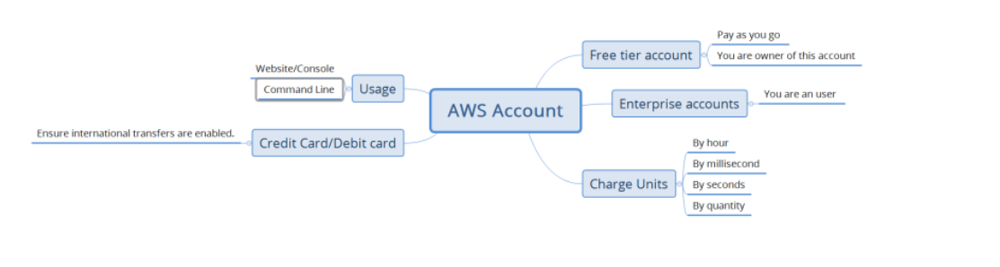
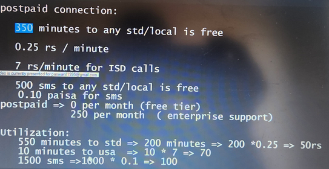
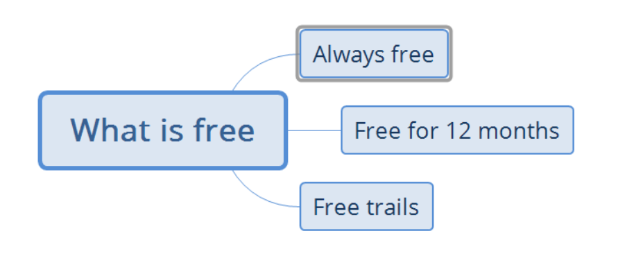
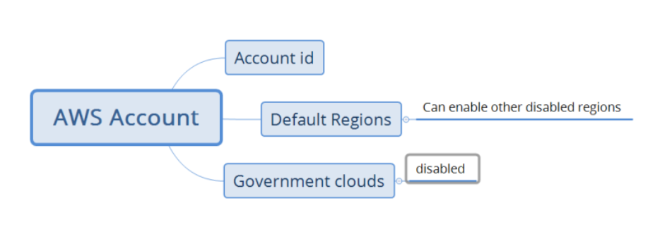

## AWS MIGRATIONS

## AWS Free Tier Account and Services

* Free/Enterprise account overview

* ## AWS Services
* refer: https://aws.amazon.com/products/?aws-products-all.sort-by=item.additionalFields.productNameLowercase&aws-products-all.sort-order=asc&awsf.re%3AInvent=*all&awsf.Free%20Tier%20Type=*all&awsf.tech-category=*all

* ## What is free
* https://aws.amazon.com/free/?all-free-tier.sort-by=item.additionalFields.SortRank&all-free-tier.sort-order=asc&awsf.Free%20Tier%20Types=tier%2312monthsfree&awsf.Free%20Tier%20Categories=*all

* 
* ## AWS Account
* Every AWS Account gets a unique account id
* By default certain regions will be disabled, you can request aws to enable 
* AWS Gov Clouds do exist
* 
* AWS Service limits : https://docs.aws.amazon.com/general/latest/gr/aws_service_limits.html
* To view the quotas, ensure you are logged in and Refer Here:https://signin.aws.amazon.com/signin?redirect_uri=https%3A%2F%2Fconsole.aws.amazon.com%2Fservicequotas%2Fhome%3FhashArgs%3D%2523%26isauthcode%3Dtrue%26state%3DhashArgsFromTB_ap-southeast-2_5379817d6275f8b4&client_id=arn%3Aaws%3Asignin%3A%3A%3Aconsole%2Fservicequotas&forceMobileApp=0&code_challenge=zdDqR_iJ3d1AVOAgVmzdNFZlcDAaC9nt65ACCpy8dZ0&code_challenge_method=SHA-256 for viewing the quotas. 
* To manage multiple accounts AWS has Organizations Refer Here:https://aws.amazon.com/organizations/

* ## Users:

    *  IAM User
    * Root User

##