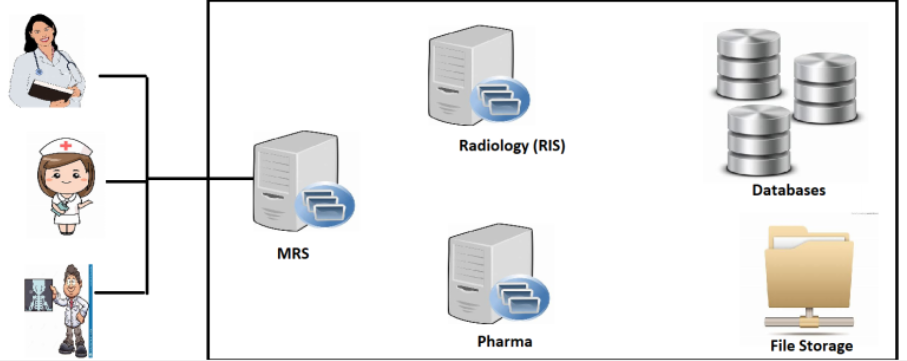
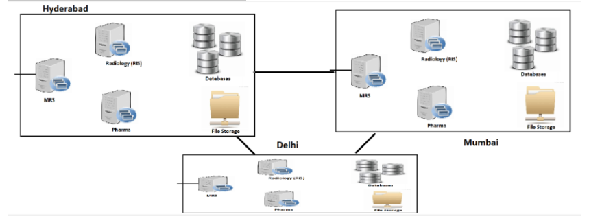
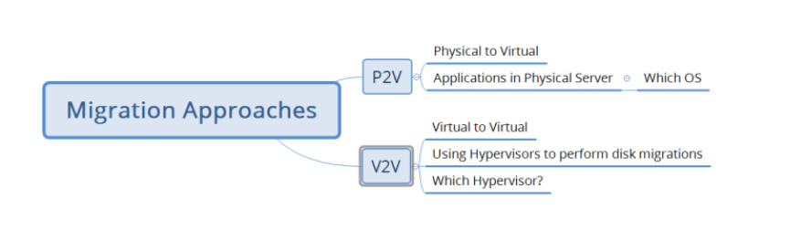
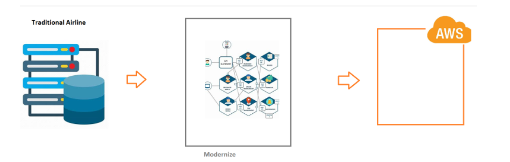

## Medical Record System – Cloud Journey

* The organization iHealthSystems has a medical record system.
* The architecture of this application is

* To make this application accesible, iHealthSystem is having Datacenters in,

       * Hyderabad
       * Mumbai
       * Delhi
  
* To maintain this application, the following skills are required.
       * Data center administration
       * Network Administration
       * Windows/Linux Administration
       * Database Adminstration
       * Storage Administration
  

* To reduce the maintenance overhead and costs, iHealthSystems wants to use cloud.
* Minimal Expectation from cloud
       * Things should be running as it is.
       * During adoption of cloud my applications should be up and running.

* Options:
       * Migration    
       * Rewrite everything for cloud. (Modernizing)

* Migration Process (Draft)
       * List out all the servers
       * Identify the Migration Approach (P2V or V2V)

*      
       * Figure out the server migrations which are supported by AWS
       * Testing approach
* The ways of migrating the following are different
       * Virtual Machines
       * Storage
       * Databases

* Order of Migration
  
       * Least dependent to most dependent as this helps in phased migration.   

## Online Grocery Delivery in Minutes

* This idea is approved and budget is allocated.
* In these cases we develop cloud native applications.
  
## Modernize Airline Reservation

* Overview

##   