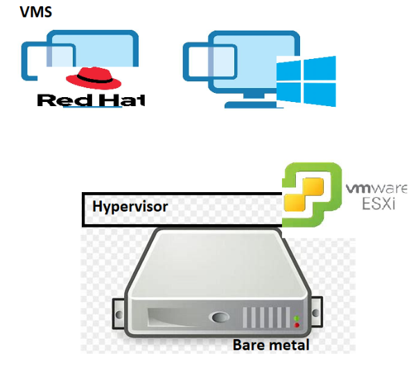
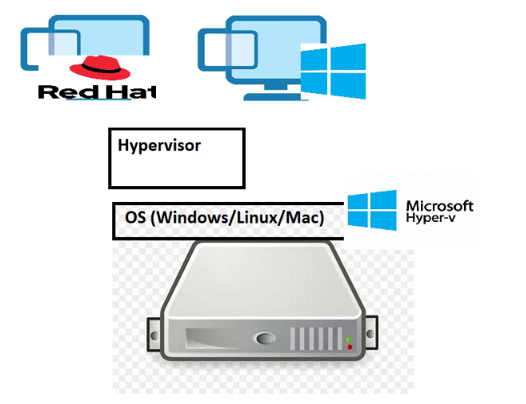
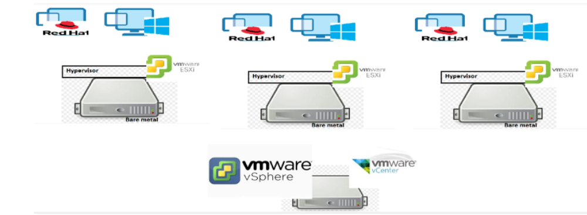
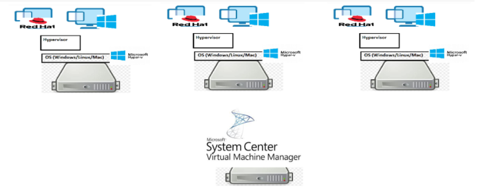
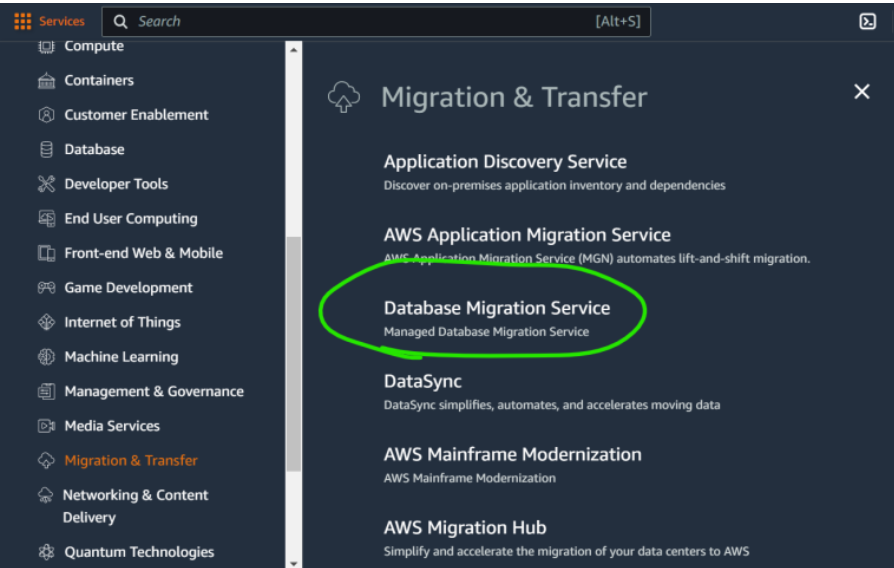
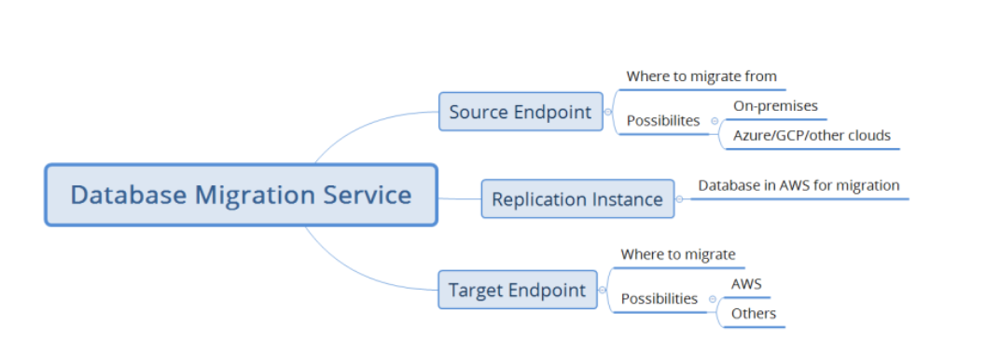
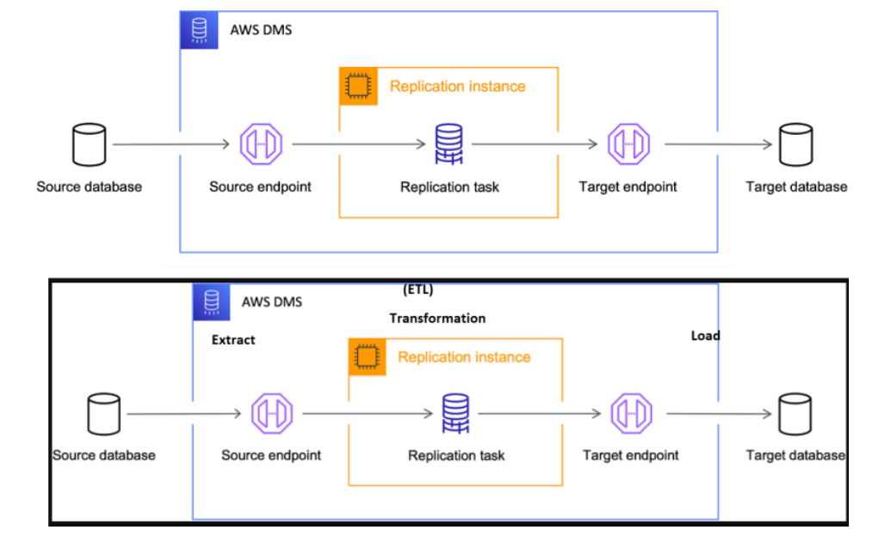

## AWS Migrations (Contd..)

* __Hypervisor__

* Hypervisor is used to create virtual Machines
* There are two types of Hypervisors
      * Type 1
           * This is installed on the Bare metal and helps in creating virtual machines
           * Examples:
                 * Vmware ESXI
                 * Vmware SPHERE 
                  
      * Type 2
           * This is installed on top of Operating Systems and helps in creating vms
           * Examples:
                 * HyperV
                 * Virtual Box
                 * Vmware Workstation
                 * KVM
                  
* Virtualization Software (Management)


* Generally when we migrate the applications in VM we connect to the virtualization softwares.
* ## What can be migrated?
       * AWS allows migration from
           * Servers:
               * Physical Servers to AWS
               * Virtual machines to AWS
                   * Vmware
                   * HyperV
           * Datatbase
           * Storage 
* Modernization
     ```
      * application to Container in Kubernetes
      * application to Serverless(Lambda function)
     ```

* ## Database Migrations
* AWS has a service called as Database Migration Service (DMS)

* Pricing refer:https://aws.amazon.com/dms/pricing/
* for official docs of Database Migration Service (DMS). Refer:https://docs.aws.amazon.com/dms/latest/userguide/Welcome.html
  

* What Databases AWS Supports?
      
     ```
      * mysql
      * Microsoft SQL server 
      * Postgres
      * Oracle
     ``` 
* When the source database engine is one of the above then we would not have much of issues. But if we want to move from IBM DB2 to mysql then AWS also supports this.
  
* The support of Cross DB Engine Migration is acheived by Schema Conversion Tool which is applied at replication instance.
  
* __Replication insatance__ has 2 purpose its acts as a cash whatever had been done so far its stores that and if you want moving from one engine to other engine basically try to do some conversation. 
  

* ## Lab Migrations
* We will do the following migrations
```
         * mysql to mysql (AWS RDS)
         * Microsoft SQL Server to AWS RDS (Microsoft SQL Server)
```
* ## Assumptions:
      * We will simulate on-premises
           * We have two options
               * Create a database in any VM in Any Cloud
               * Use Database as a Service from any cloud.
   
##
