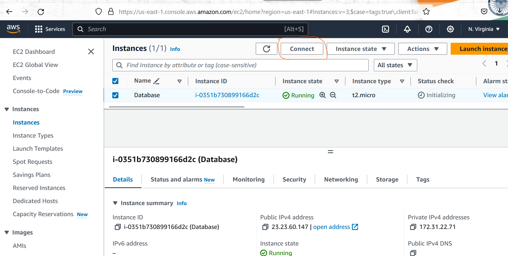
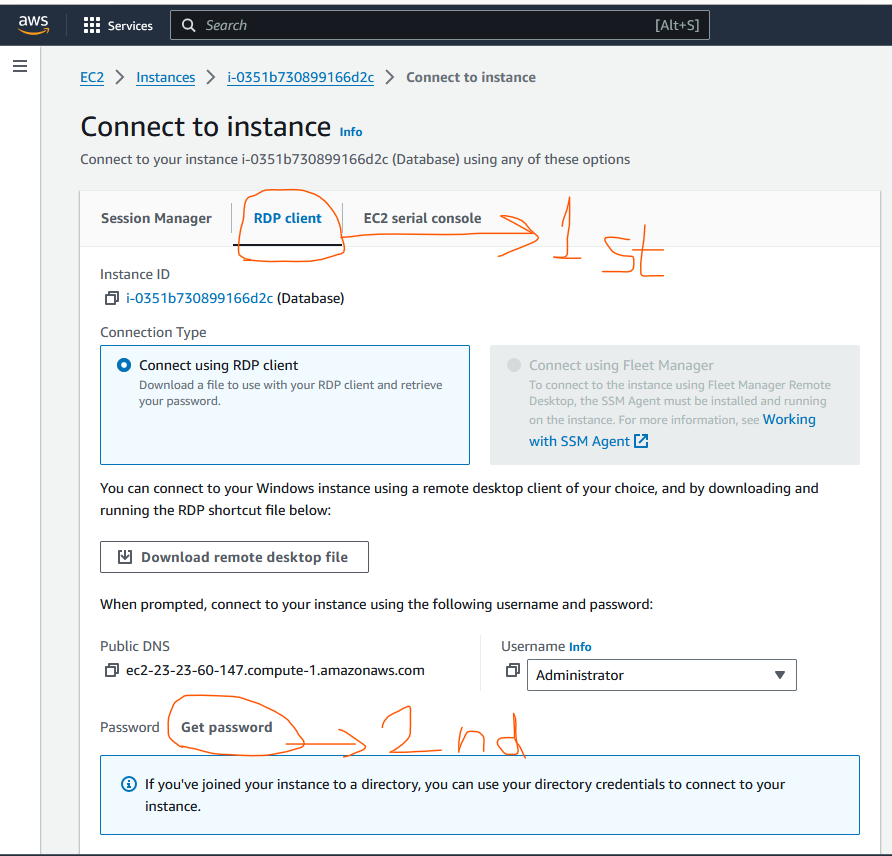
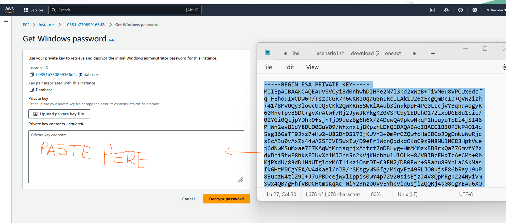
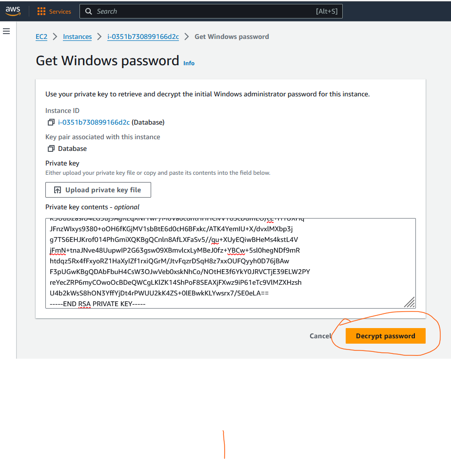
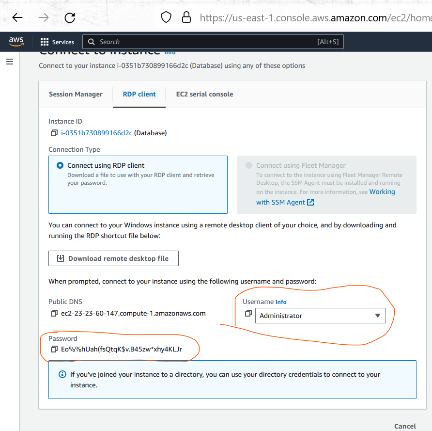
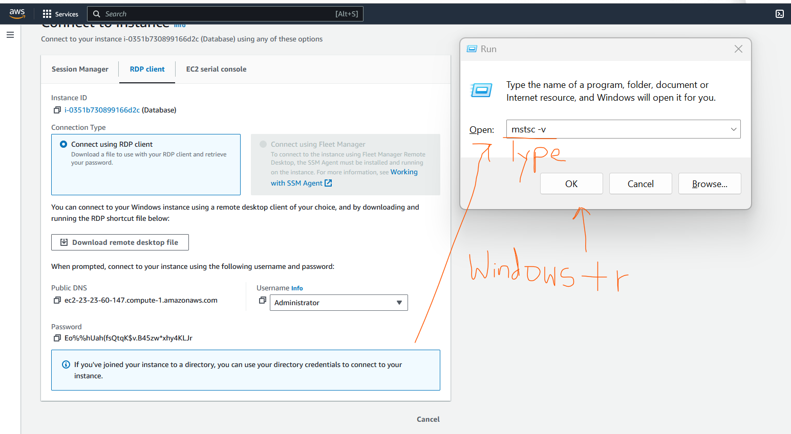
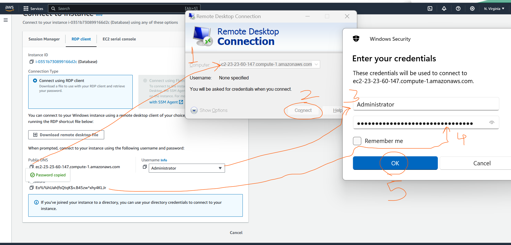
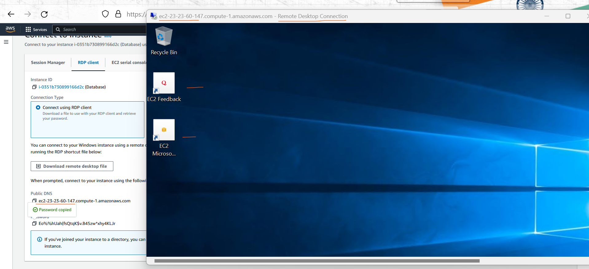

### Database Setup

* Goal 
   * Lets setup Microsoft SQL Server 
   * Import some sample Database
   * Migrate to AWS RDS 

### Microsoft SQL server setup  

* supported SQL Server Versions Refer here: https://docs.aws.amazon.com/dms/latest/userguide/CHAP_Source.SQLServer.html
* Lets create windows EC2 instance in AWS which will stimulate on-premises Microsoft SQL Server.
* for mac user have to download windows remote desktop viewer

* use Windows+r = mstsc -v 

* Generate password from the pem file. connect to windows vm using `mstsc -v <public ip/dns>`
* Install microsoft sql server 2017 and SQL Server Management studio as discussed in the class (refer video recording)
* For sample data lets use Adventure works Refer :https://learn.microsoft.com/en-us/sql/samples/adventureworks-install-configure?view=sql-server-ver16&tabs=ssms
* 
