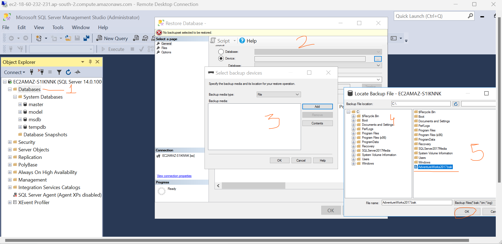

### Database Setup

* Goal 
   * Lets setup Microsoft SQL Server 
   * Import some sample Database
   * Migrate to AWS RDS 

### Microsoft SQL server setup  

* supported SQL Server Versions Refer here: https://docs.aws.amazon.com/dms/latest/userguide/CHAP_Source.SQLServer.html
* Lets create windows EC2 instance in AWS which will stimulate on-premises Microsoft SQL Server.
* for mac user have to download windows remote desktop viewer

* use Windows+r = mstsc -v 

* Generate password from the pem file. connect to windows vm using `mstsc -v <public ip/dns>`
* Launch server manager

* go to explorer and download google chrome 
* Install microsoft sql server 2017 and SQL Server Management studio as discussed in the class (refer video recording)
* choose `try now` instead of `watch now` and then download
* For sample data lets use Adventure works Refer :https://learn.microsoft.com/en-us/sql/samples/adventureworks-install-configure?view=sql-server-ver16&tabs=ssms

* Download now after filling the area above image showing and if you want to increase windows volume size so you have to go in AWS section and choose volume section and increase as per you usage i want 100GB so took 100 GB and then stoped your EC2 instance then run again .
* after giving again credentials go to disk section and now you able to increase the size 30 to 100GB 

* Now click on sqlserver2017 
  

* After locate and select the data click ok then go to option section and select `all 3 replicated data options` then click on ok.

* Now close the machine because source is ready .

## Mysql Setup

* Try installing mysql on free linux instance Refer Here: https://www.digitalocean.com/community/tutorials/how-to-install-mysql-on-ubuntu-22-04

