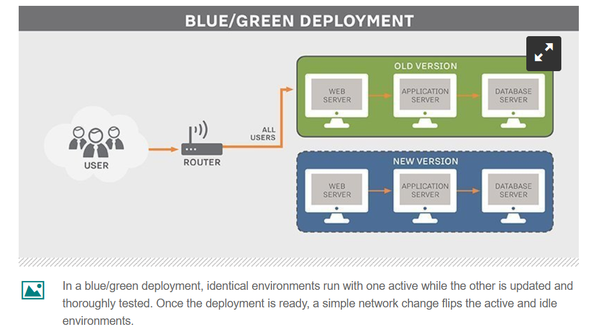

### AWS RDS Migration

* what is blue and green deployemnent ? : https://semaphoreci.com/blog/blue-green-deployment

* We have microsoft SQL Developer Edition (on-premises)
* Lets create the destination/target which is microsoft SQL server developer

