# AWS     
## ssh-keygen
* 1) if you want to do directly connect to the aws machine like `ssh ubuntu@ip` then you have to create 1st rsa.pub but for that you have to do `ssh-keygen` in your windows terminal.
* 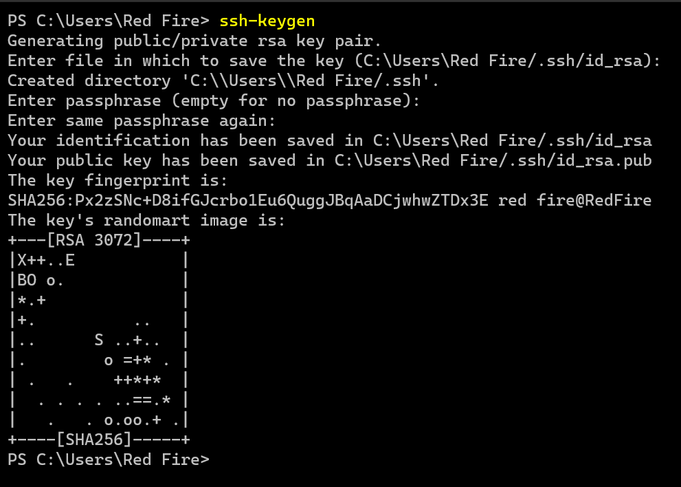
* 2) It will create .ssh folder in your machine . Now open `.ssh` folder in that u will see `id_rsa.pub` file.
* 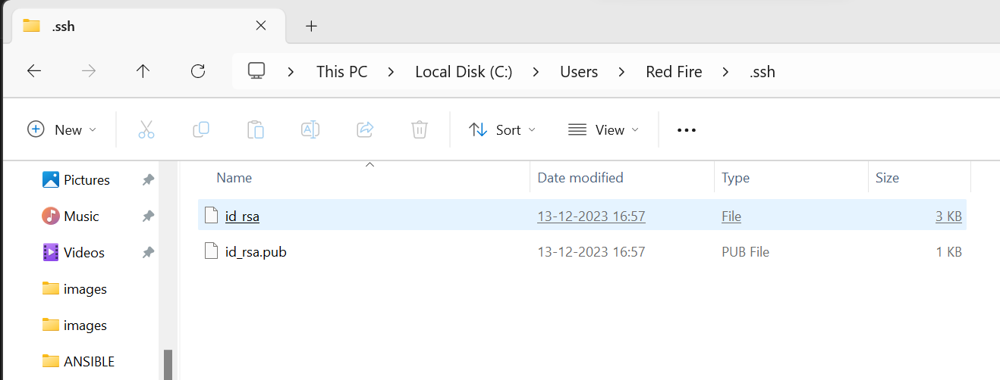
## Key Pairs && Security Group
* 3) now you have to import/create `key pairs` in aws account for that you have to go in  `aws` account then click on `key pairs` section. now click on `Action` -> choose `Import key pair`
* 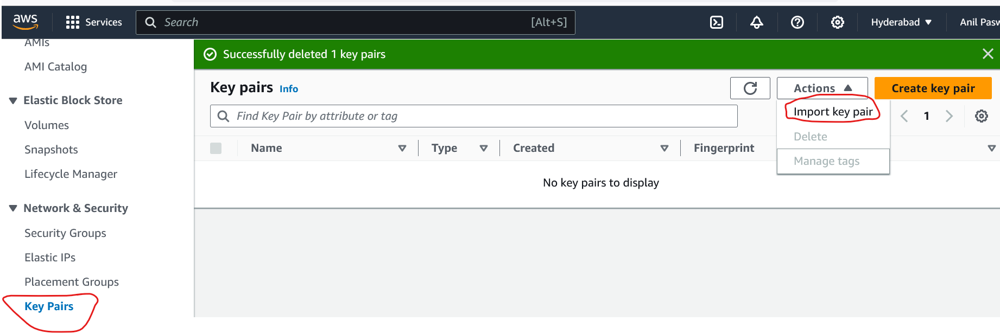
* 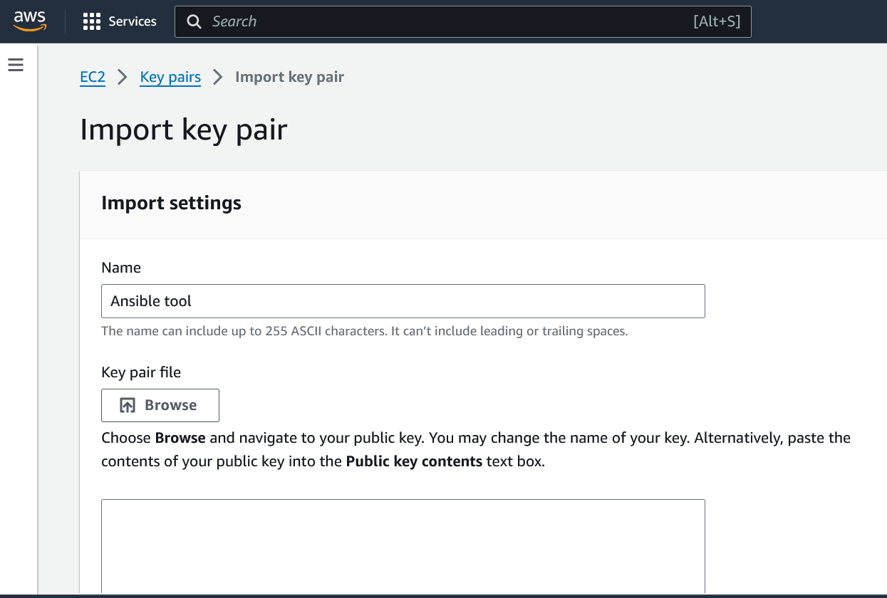
* 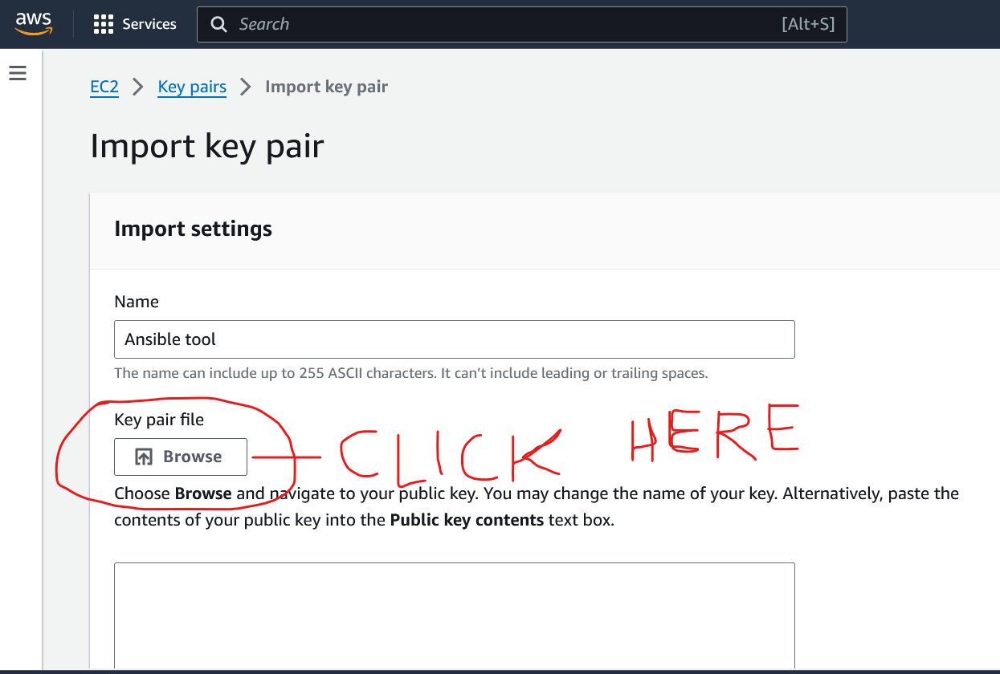
* 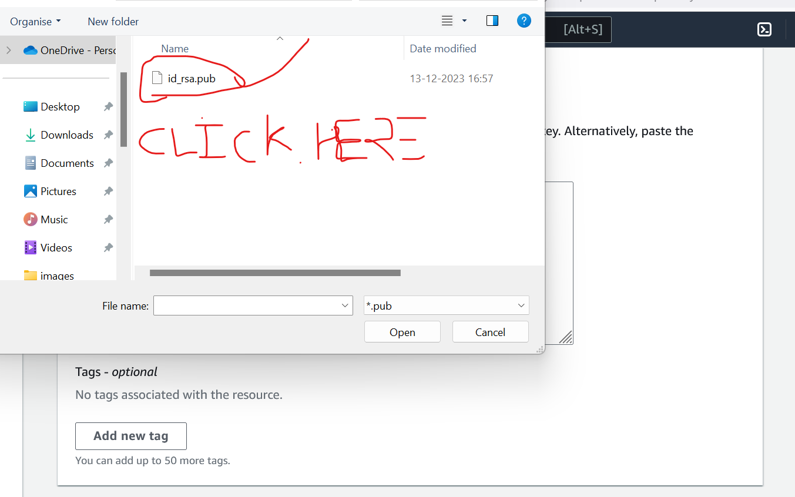
* 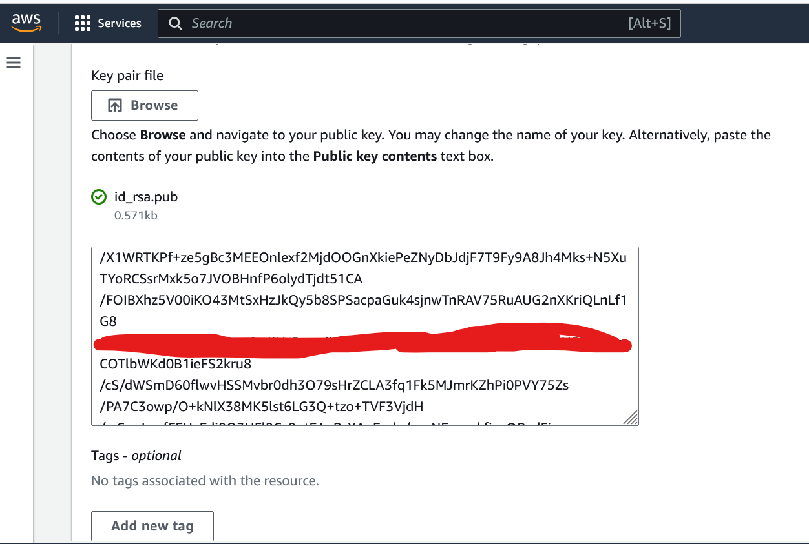
* 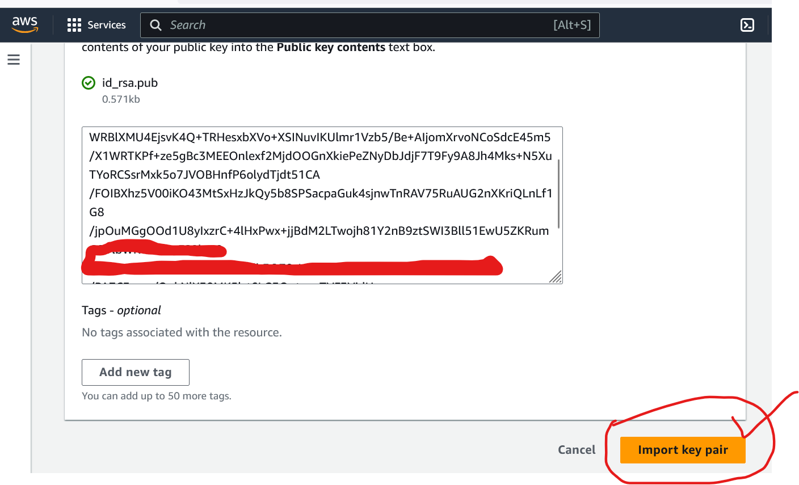
* Now choose that `key pair name` . If you are not created security group so choose default one or security group and now create aws instance.
* 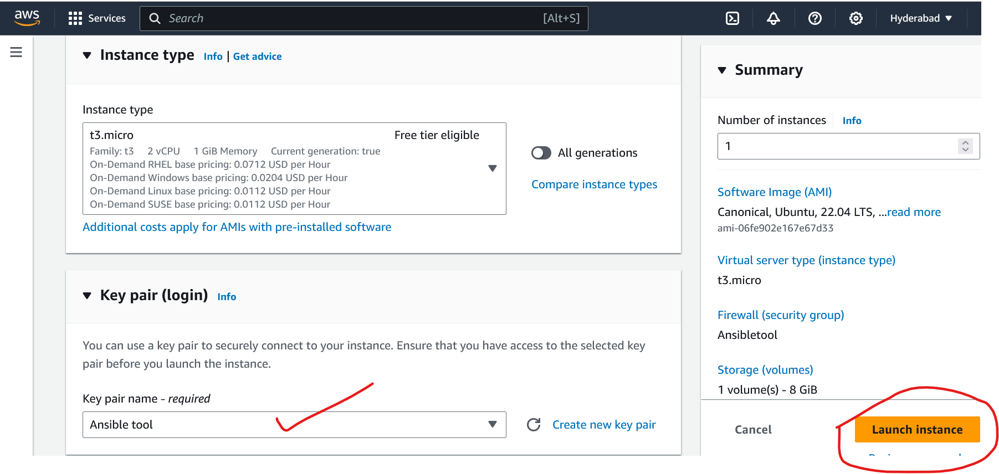
* 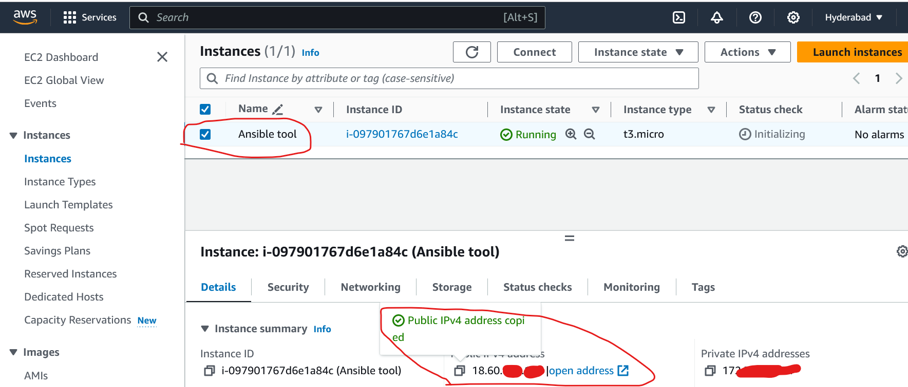
* copy that `public id` and go on terminal write there `cd ~` `ssh ubuntu@ip address` paste here.
* 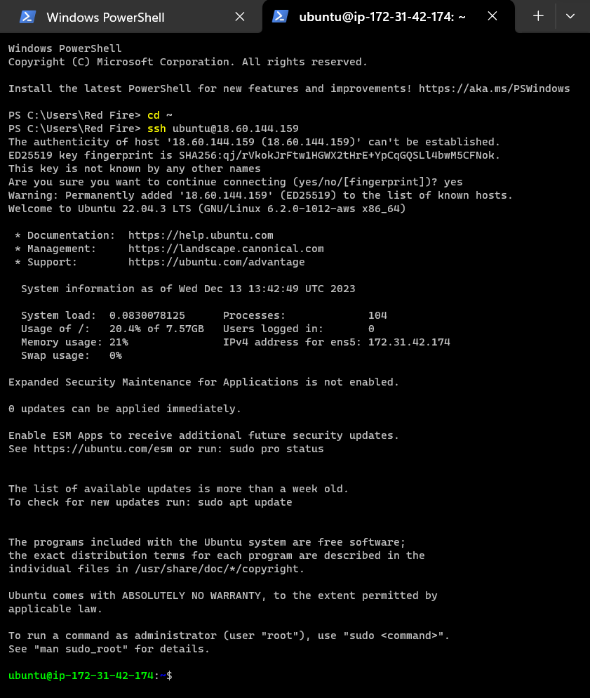
* ----------------------------------------------------------------------------------------------------------
